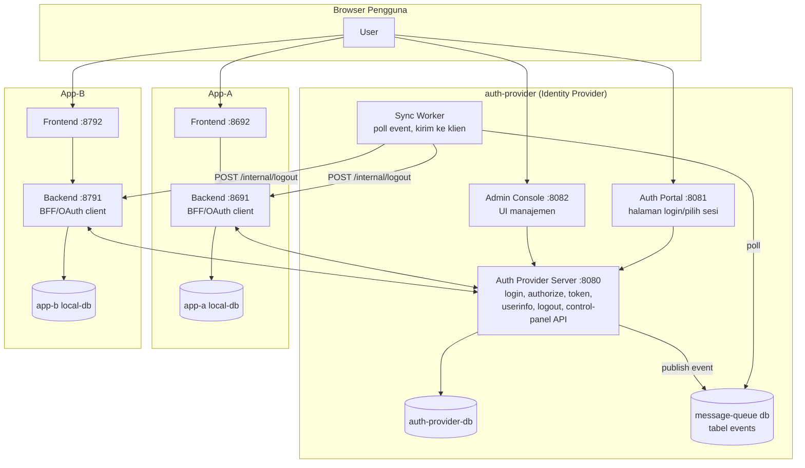
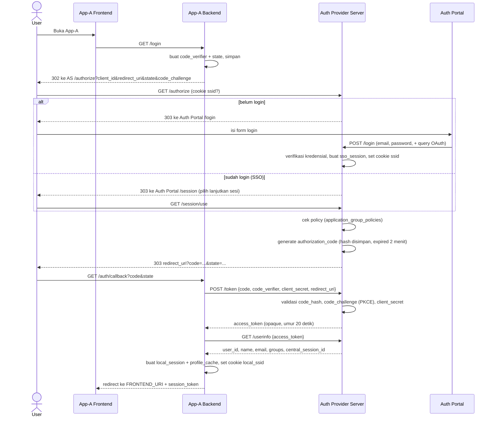

# 13524057_Seleksi-2-Calon-Asisten-Labpro-2026

# 13524057 — Seleksi 2 Calon Asisten Labpro 2026

Sistem **Single Sign-On (SSO)** custom berbasis alur *OAuth 2.0 Authorization Code + PKCE*, terdiri dari satu **Identity/Auth Provider** terpusat dan dua **Aplikasi Klien** (App-A, App-B) yang mendelegasikan autentikasi ke provider tersebut. Provider juga memiliki mekanisme *backchannel logout* asinkron (event queue + worker) sehingga logout dari satu klien akan menyebar (propagate) ke seluruh klien lain yang membagikan sesi SSO yang sama.

## Daftar Isi

1. [Cara Menjalankan Sistem](#1-cara-menjalankan-sistem)
2. [Arsitektur & Alur](#2-arsitektur--alur)
3. [Keputusan Teknis](#3-keputusan-teknis)
4. [Technology Stack](#4-technology-stack)
5. [Daftar Endpoint](#5-daftar-endpoint)

---

## 1. Cara Menjalankan Sistem

### 1.1 Prasyarat

| Tool | Kegunaan |
|---|---|
| Docker & Docker Compose v2 (`docker compose`) | Menjalankan seluruh service (DB, backend, frontend) |
| Go ≥ 1.25 | Menjalankan skrip *seeding* dari host (di luar container) |
| Port host `5342, 5343, 8080-8084, 8081, 8082, 8690-8692, 8790-8792` bebas | Semua service memetakan port ke host |

### 1.2 Konfigurasi Environment

Seluruh compose file (root, `auth-provider/`, `applications/app-a/`, `applications/app-b/`) di-include lewat satu `docker-compose.yml` di root, dan **hanya membaca satu file `.env` di root proyek**. `.env.example` yang tersedia baru mencakup sebagian variabel; lengkapi seperti berikut sebelum menjalankan apa pun:

```bash
cp .env.example .env
```

Isi `.env` (root) dengan seluruh variabel berikut:

```bash
# --- Password database (MySQL root) ---
AUTH_PROVIDER_DB_PASS=changeme
MESSAGE_QUEUE_DB_PASS=changeme
APP_A_DB_PASS=changeme
APP_B_DB_PASS=changeme

# --- Alamat DB di jaringan docker internal (service:port, BUKAN port host) ---
AUTH_PROVIDER_DB_ADDRESS=auth-provider-db:3306
MESSAGE_QUEUE_ADDRESS=message-queue:3306
APP_A_DB_ADDRESS=app-a-local-db:3306
APP_B_DB_ADDRESS=app-b-local-db:3306

# --- URL frontend yang diizinkan CORS oleh auth-provider-server ---
AUTH_PORTAL_URL=http://localhost:8081
ADMIN_CONSOLE_URL=http://localhost:8082
APP_A_FRONTEND=http://localhost:8692
APP_B_FRONTEND=http://localhost:8792

# --- Alamat auth-provider-server: browser-facing vs container-to-container ---
AUTH_SERVER_URL=http://localhost:8080              # dipakai untuk redirect di browser
AUTH_SERVER_URL_2=http://auth-provider-server:8080 # dipakai backend app-a/b saat POST /token & /userinfo

# --- Alamat backend App-A: browser-facing vs container-to-container ---
APP_A_BACKEND=http://localhost:8691                # redirect_uri OAuth & launch_url
APP_A_BACKEND_2=http://app-a-backend:8691          # dipakai sync-worker memanggil /internal/logout

# --- Alamat backend App-B ---
APP_B_BACKEND=http://localhost:8791
APP_B_BACKEND_2=http://app-b-backend:8791

# --- Kredensial OAuth client tiap aplikasi (harus konsisten dgn data seed) ---
CLIENT_A_ID=app-a-client
CLIENT_A_SECRET=changeme
CLIENT_B_ID=app-b-client
CLIENT_B_SECRET=changeme
```

> Pasangan `*_URL`/`*_URL_2` (dan `*_BACKEND`/`*_BACKEND_2`) sengaja dipisah karena browser mengakses lewat port yang di-*publish* ke host (`localhost:xxxx`), sedangkan panggilan antar container (server-to-server) harus memakai nama service di jaringan docker internal — keduanya tidak bisa memakai URL yang sama.

### 1.3 Menjalankan `docker compose up`

Dari root proyek:

```bash
docker compose up -d --build
```

Ini akan menyalakan, sesuai urutan `depends_on` + `healthcheck`:

1. `auth-provider-db`, `message-queue`, `app-a-local-db`, `app-b-local-db` (MySQL 8.0)
2. `auth-provider-server`, `sync-worker` (menunggu DB sehat)
3. `auth-portal`, `admin-console` (menunggu `auth-provider-server`)
4. `app-a-backend`, `app-b-backend` (menunggu local DB masing-masing sehat)
5. `app-a-frontend`, `app-b-frontend`

### 1.4 Migration

Tidak ada tool migrasi terpisah (tidak memakai `gorm.AutoMigrate`). Skema tabel dibuat otomatis oleh image MySQL resmi melalui file inisialisasi yang di-*mount* ke `/docker-entrypoint-initdb.d`:

- `auth-provider/primary-db/init/server-db.sql` → database `auth-provider-db`
- `auth-provider/message-queue/init/message-queue.sql` → database `queue`
- `applications/app-a/local-db/app-a-db.sql` → database `app-db` milik App-A
- `applications/app-b/local-db/app-b-db.sql` → database `app-db` milik App-B

Script ini **hanya dieksekusi sekali**, saat volume data MySQL kosong (pertama kali container dibuat). Jika skema perlu diterapkan ulang (misalnya setelah mengubah file `.sql`), hapus volume-nya terlebih dahulu:

```bash
docker compose down -v   # menghapus seluruh volume, termasuk data
docker compose up -d --build
```

### 1.5 Seeding

Data awal (user, group, kebijakan grup↔aplikasi, registrasi App-A & App-B ke provider) diisi lewat program Go terpisah yang dijalankan **dari host** (bukan di dalam docker), setelah `auth-provider-db` naik dan port `5342` sudah bisa diakses:

```bash
cd seeding
go run main.go
```

Program ini membaca `.env` dari root (`godotenv.Load("../.env")`) dan terhubung ke `localhost:5342` (port host yang dipetakan ke `auth-provider-db`). Pastikan variabel `CLIENT_A_ID/SECRET`, `CLIENT_B_ID/SECRET`, `APP_A_FRONTEND/BACKEND/BACKEND_2`, `APP_B_FRONTEND/BACKEND/BACKEND_2` sudah terisi di `.env` sebelum menjalankan seeder, karena nilai-nilai itu langsung dipakai untuk membuat baris `applications` beserta `application_redirect_uris`-nya.

Data yang di-seed antara lain:
- 40 user (password bcrypt), termasuk 1 admin (`authadmin1@authprovider.com` / `password123`) dan beberapa user berstatus `Inactive`.
- 3 group: `Administrators`, `App-A Users`, `App-B Users`.
- Kebijakan (`application_group_policies`): `Administrators` di-*Allow* untuk App-A & App-B; masing-masing group pengguna di-*Allow* untuk aplikasi terkait.
- Registrasi App-A & App-B sebagai OAuth client (client secret di-hash, redirect URI didaftarkan).

### 1.6 URL Tiap Komponen

| Komponen | URL (host) | Keterangan |
|---|---|---|
| Auth Provider Server (API sentral) | http://localhost:8080 | OAuth/SSO API, Control Panel API |
| Auth Portal (halaman login SSO) | http://localhost:8081 | Frontend login/pilih sesi |
| Admin Console | http://localhost:8082 | UI manajemen user/group/app/policy |
| Sync Worker | (tidak ada HTTP API) | Proses background: kirim event ke klien |
| App-A Backend | http://localhost:8691 | BFF App-A (OAuth client) |
| App-A Frontend | http://localhost:8692 | UI App-A |
| App-A Local DB | localhost:8690 (host) | MySQL, akses langsung utk debugging |
| App-B Backend | http://localhost:8791 | BFF App-B (OAuth client) |
| App-B Frontend | http://localhost:8792 | UI App-B |
| App-B Local DB | localhost:8790 (host) | MySQL, akses langsung utk debugging |
| Auth Provider DB | localhost:5342 (host) | MySQL, dipakai juga oleh seeder |
| Message Queue DB | localhost:5343 (host) | MySQL, tabel `events`/`event_deliveries` |

**Alur mencoba sistem:** buka http://localhost:8692 (App-A) atau http://localhost:8792 (App-B) → diarahkan login lewat http://localhost:8081 → login dengan salah satu user hasil seeding → kembali ke aplikasi klien dalam keadaan sudah authenticated. Untuk mengelola user/group/app/policy, buka http://localhost:8082 dan login sebagai `authadmin1@authprovider.com`.

---

## 2. Arsitektur & Alur

### 2.1 Komponen



- **Auth Provider Server**: pemilik satu-satunya tabel `users`, `groups_`, `applications`, `sso_sessions`, `access_tokens`, `authorization_codes`, `audit_logs`. Menyediakan dua kelompok API: *Central Session Server* (OAuth/SSO: `/login`, `/authorize`, `/token`, `/userinfo`, `/logout`, dst.) dan *Control Panel* (CRUD user/group/app/policy, dipakai Admin Console).
- **Auth Portal**: SPA React yang jadi halaman login terpusat. Semua klien yang butuh login me-redirect ke sini.
- **Admin Console**: SPA React untuk operator mengelola user, group, aplikasi terdaftar, dan kebijakan akses (group ↔ app).
- **App-A / App-B**: dua aplikasi klien yang identik secara arsitektur (beda nama/DB/klien OAuth). Backend masing-masing bertindak sebagai *Backend-for-Frontend* + OAuth client: memulai Authorization Code flow, menukar `code` jadi *access token* opaque, memanggil `/userinfo`, lalu membuat **sesi lokal miliknya sendiri** (`local_sessions`) dan cache profil (`profile_cache`) — App-A/B tidak pernah menyimpan token/sesi milik Auth Provider secara langsung ke browser pengguna.
- **Message Queue (DB) + Sync Worker**: menggantikan message broker konvensional (lihat [§3.2](#32-pilihan-message-broker)). Auth Provider Server menulis baris ke tabel `events` setiap kali terjadi kejadian yang perlu disebarluaskan (logout, ganti password, user di-nonaktifkan/dihapus). Sync Worker men-*poll* tabel ini secara berkala, memecahnya menjadi satu `event_deliveries` per aplikasi tujuan, lalu mem-POST payload event tsb ke endpoint `/internal/logout` masing-masing aplikasi klien dengan retry otomatis.

### 2.2 Alur Login (Authorization Code + PKCE)



### 2.3 Alur Logout & Backchannel Propagation

1. User klik logout di App-A → `App-A Backend POST /logout` (hanya mencabut `local_session` App-A + hapus cookie lokal — **tidak** memberi tahu provider).
2. User logout lewat **Auth Portal** (`POST /logout` ke Auth Provider Server) → sesi SSO (`sso_sessions`) di-set `Revoked`, dan sebuah baris `SessionRevoked` di-*publish* ke tabel `events` (message queue).
3. **Sync Worker** men-*poll* `events` tiap 5 detik, membuat `event_deliveries` untuk setiap aplikasi terdaftar (App-A & App-B), lalu mem-POST payload event tersebut ke `logout_notification_url` masing-masing aplikasi (yaitu `.../internal/logout`), dengan retry berkala (maks. 200 percobaan) jika gagal.
4. Setiap backend klien menerima event di `POST /internal/logout`, mencabut `local_session` miliknya yang cocok dengan `user_id` + `central_session_id`, dan mencatat event tersebut sudah diproses (`processed_events`) — bersifat *idempotent* jika event yang sama dikirim ulang.

Kejadian lain yang memicu event serupa (revoke sesi + publish ke queue): user diganti password, user di-set `Inactive`, atau user dihapus lewat Control Panel/Admin Console.

---

## 3. Keputusan Teknis

### 3.1 Pilihan Token: Opaque (bukan JWT)

**Keputusan:** seluruh token yang beredar ke pihak luar — *session cookie* (`ssid`, `local_ssid`), *authorization code*, dan *access token* — adalah **string acak (opaque)** hasil `crypto/rand` (fungsi `CryptoRandString`), bukan JWT yang *self-contained*. Yang disimpan di database bukan token itu sendiri, melainkan **SHA-256 hash**-nya (`HashToken`), sehingga validasi selalu berupa *lookup* baris di tabel `sso_sessions` / `access_tokens` / `authorization_codes` berdasarkan hash tsb, plus pengecekan kolom `status`/`expires_at`.

**Konsekuensi:**

| Aspek | Dampak |
|---|---|
| ✅ Revocation instan | Logout/nonaktifkan user cukup mengubah kolom `status` jadi `Revoked` — berlaku detik itu juga untuk semua pemegang token. Ini krusial karena sistem butuh *backchannel logout* real-time-ish. Dengan JWT, revocation butuh mekanisme tambahan (blocklist/short TTL) karena JWT valid sampai *expired* meski di-"logout". |
| ✅ Tidak ada kebocoran data lewat token | Token tidak membawa payload apa pun (bukan Base64 klaim), sehingga tidak ada risiko klaim usang/`ID` sensitif ter-*expose* jika token dicuri lalu di-decode. |
| ❌ Setiap request perlu round-trip DB | Validasi token = query database (bukan verifikasi tanda tangan lokal), sehingga Auth Provider Server menjadi *single source of truth* yang harus dihubungi (lihat `/userinfo`) — kurang scalable dibanding JWT untuk arsitektur *stateless*/microservice yang sangat terdistribusi tanpa DB bersama. |
| ⚖️ Trade-off yang diambil | Karena skenario utamanya adalah SSO tersentralisasi dengan kebutuhan *instant session revocation* antar banyak klien, kontrol atas sesi dianggap lebih penting daripada skalabilitas stateless a-la JWT. Password & client secret tetap di-hash pakai **bcrypt** (lambat, cocok untuk verifikasi sekali & tahan *brute-force*), sedangkan token session/kode di-hash pakai **SHA-256** (cepat, karena dipakai sebagai kunci pencarian, bukan untuk verifikasi rahasia lambat). |

### 3.2 Pilihan Message Broker

**Keputusan:** tidak memakai broker pesan konvensional (RabbitMQ/Kafka/Redis Streams), melainkan **MySQL sebagai *queue* berbasis tabel** (`events` + `event_deliveries`), dengan **Sync Worker** sebagai consumer yang men-*poll* tabel tersebut setiap 5 detik (pola *polling outbox*, bukan *push/pub-sub*).

**Konsekuensi:**

| Aspek | Dampak |
|---|---|
| ✅ Sederhana & tanpa infrastruktur tambahan | Tidak perlu menjalankan/mengelola broker terpisah; event ditulis dengan `INSERT` biasa di database yang sudah ada, mudah di-inspeksi lewat SQL biasa untuk debugging/audit. |
| ✅ Retry & tracking eksplisit | Tabel `event_deliveries` menyimpan `attempt_count`, `next_retry_at`, `last_error`, `status` per pasangan (event, aplikasi tujuan) — memudahkan observability pengiriman *at-least-once* tanpa fitur khusus broker. |
| ❌ Latensi *polling* | Event baru paling cepat diproses ~5 detik kemudian (interval ticker), bukan hampir instan seperti *push*-based broker. |
| ❌ Skalabilitas terbatas | Satu instance Sync Worker yang melakukan *polling* linear; menambah banyak *consumer* paralel butuh penguncian baris (row locking) yang belum diimplementasikan — DB berpotensi jadi bottleneck bila volume event besar. |
| ⚖️ Trade-off yang diambil | Untuk skala tugas ini (SSO 2 aplikasi klien, event terutama seputar logout/perubahan status akun), kesederhanaan operasional (tanpa dependensi Docker image baru) dinilai lebih menguntungkan daripada throughput/latensi rendah yang ditawarkan broker khusus pesan. |

### 3.3 Autentikasi Service-to-Service untuk `/internal/logout`

**Kondisi implementasi saat ini:** endpoint `POST /internal/logout` pada `app-a-backend`/`app-b-backend` **tidak memiliki lapisan autentikasi eksplisit** (tidak ada shared secret, HMAC signature, mTLS, maupun API key). Endpoint ini menerima payload event (`user_id`, `central_session_id`, `event_type`, dst.) langsung dari Sync Worker dan mempercayainya berdasarkan **isolasi jaringan**: Sync Worker memanggil endpoint tersebut melalui alamat container-internal (`APP_A_BACKEND_2` / `APP_B_BACKEND_2`, mis. `http://app-a-backend:8691`) yang hanya bisa dijangkau di dalam jaringan Docker Compose yang sama, dan URL tujuan (`logout_notification_url`) sendiri hanya bisa diset lewat Control Panel saat registrasi aplikasi (bukan input pengguna akhir).

**Konsekuensi:**

| Aspek | Dampak |
|---|---|
| ✅ Sederhana untuk kebutuhan tugas ini | Tidak perlu manajemen kunci/sertifikat tambahan antar service. |
| ❌ Rentan bila port backend ter-*expose* publik | Jika port `8691`/`8791` (atau reverse proxy di depannya) bisa diakses dari luar jaringan Docker, siapa pun bisa mengirim POST palsu ke `/internal/logout` dan memaksa pencabutan sesi lokal user tertentu (denial-of-service terhadap sesi, meski tidak membocorkan data karena payload hanya berisi ID, bukan kredensial). |
| ❌ Tidak ada jaminan integritas/asal pesan | Endpoint tidak bisa membedakan panggilan asli dari Sync Worker vs panggilan dari pihak lain yang kebetulan berada di jaringan yang sama. |
| ➡️ Rekomendasi pengerasan (belum diimplementasikan) | Menambahkan **HMAC signature** per-aplikasi (memakai `client_secret` yang sudah ada sebagai *shared secret*, mis. header `X-Signature: HMAC-SHA256(body, client_secret)`) yang diverifikasi oleh `BackChannelLogoutRequest` sebelum memproses event, sebagai lapisan pertahanan tambahan di luar isolasi jaringan. |

### 3.4 Soft-Delete vs Hard-Delete

**Keputusan:** sistem memakai **hard-delete** untuk entitas `users`, `groups_`, `applications`, dan relasi turunannya — `db.Delete(&model)` pada GORM menghasilkan `DELETE` SQL sungguhan karena model **tidak memiliki kolom `deleted_at`/`gorm.Model`**. Penghapusan fisik ini mengandalkan **`ON DELETE CASCADE`** pada foreign key (`user_groups`, `sso_sessions`, `access_tokens`, `authorization_codes`, `application_redirect_uris`, `application_group_policies`, dan **`audit_logs`**) agar tidak ada baris yatim (*orphan rows*) yang tersisa. Untuk kebutuhan "nonaktifkan tanpa menghapus", sistem sudah punya jalur terpisah: kolom **`status` (`Active`/`Inactive`)** pada `users` dan `applications` — inilah mekanisme yang dipakai Admin Console untuk menonaktifkan user/aplikasi secara reversibel tanpa kehilangan data historisnya.

**Konsekuensi:**

| Aspek | Dampak |
|---|---|
| ✅ Query & skema lebih sederhana | Tidak perlu filter `WHERE deleted_at IS NULL` di setiap query, dan tidak ada risiko *unique constraint* (mis. `email`, `client_id`) bentrok dengan baris yang "seharusnya" sudah terhapus. |
| ✅ Data benar-benar bersih | Ukuran tabel tidak membengkak oleh baris yang sebenarnya sudah tidak relevan. |
| ❌ Tidak reversibel | Sekali `DELETE` dieksekusi, data hilang permanen — tidak ada fitur "undo"/restore. Untuk kasus yang mungkin perlu dipulihkan (nonaktifkan sementara), operator harus memakai `status = Inactive`, bukan endpoint delete. |
| ❌ Riwayat audit ikut terhapus | Karena `audit_logs` memiliki FK `ON DELETE CASCADE` ke `users`, menghapus seorang user akan **ikut menghapus seluruh audit log miliknya** — berlawanan dengan tujuan audit trail yang idealnya tetap ada meski entitasnya sudah tidak ada. Ini trade-off yang disadari: hard-delete dipilih demi kesederhanaan relasional, dengan konsekuensi riwayat audit user yang dihapus tidak dapat ditelusuri lagi. |

---

## 4. Technology Stack

### Backend (Go)

| Komponen | Versi |
|---|---|
| Go | 1.25.0 |
| Gin (`gin-gonic/gin`) | v1.12.0 |
| Gin CORS middleware (`gin-contrib/cors`) | v1.7.7 |
| GORM (`gorm.io/gorm`) | v1.31.2 |
| GORM MySQL driver (`gorm.io/driver/mysql`) | v1.6.0 |
| GORM Datatypes (`gorm.io/datatypes`) | v1.2.7 |
| `google/uuid` | v1.6.0 |
| `golang.org/x/crypto` (bcrypt) | v0.48.0 |
| `joho/godotenv` (khusus modul `seeding`) | dipakai untuk load `.env` di seeder |

### Frontend (Auth Portal, Admin Console, App-A, App-B)

| Komponen | Versi |
|---|---|
| React & React DOM | ^19.2.8 |
| React Router DOM (Auth Portal & Admin Console) | ^7.18.2 |
| TypeScript | ^7.0.2 |
| Vite | ^8.2.0 |
| @vitejs/plugin-react | ^6.0.4 |
| @vitejs/plugin-basic-ssl & vite-plugin-mkcert | ^2.3.0 / ^2.1.0 |
| oxlint (linter) | ^1.75.0 |

### Database & Infrastruktur

| Komponen | Versi |
|---|---|
| MySQL (semua database: provider, queue, App-A, App-B) | 8.0 |
| Docker / Docker Compose | Compose spec v2 (`include:`) |
| Nginx (image `nginx:alpine`) | menyajikan hasil build frontend (Auth Portal, Admin Console, App-A/B Frontend) |
| Base image build | `golang:alpine` (builder) → `alpine:latest` (runtime) untuk semua service Go; `node:alpine` (builder) → `nginx:alpine` (runtime) untuk semua frontend |

---


